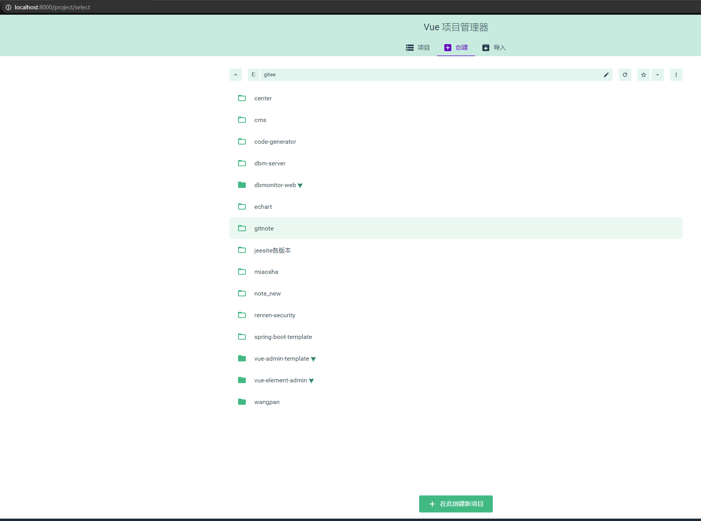
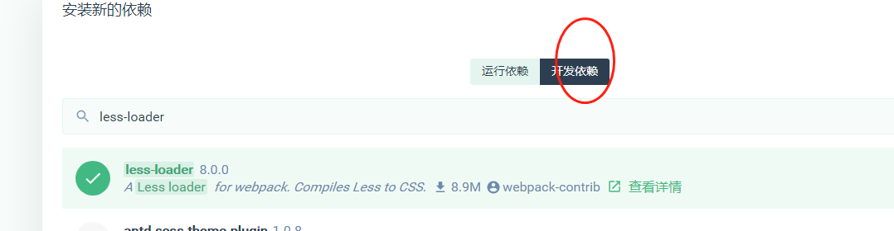
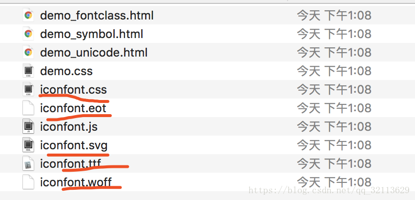

# 安装vue脚手架

## 安装cnpm

```shell
npm install -g cnpm --registry=https://registry.npm.taobao.org
#查看版本
cnpm -v

如不是内部命令
配置下 D:\program\nodejs\npm_global  path
```

## vue安装

```
#淘宝仓库
$npm config set registry=https://registry.npm.taobao.org
#显示配置
$npm config list
#检查镜像站命令
npm config get registry
$cnpm install vue  #安装vue
$ cnpm install -g vue-cli
#vue-cli 提供一个官方命令行工具
```

```
在cmd中
VUE UI的安装 需要3.0以上版本

$npm i -g @vue/cli
或
$cnpm install -g @vue/cli
$vue ui 
```

http://localhost:8000/

项目创建




选择功能： babel，router（路由），linter（格式校验）,使用配置文件


关闭历史模式，使用hash模式

## 安装element-ui组件库

在vue-ui 仪表盘

+ 插件中安装 element 

+ 依赖中安装axios  ：运行依赖

+ 用vscode打开：

+ 打开终端，查看项目状态：git status  

git checkout -b login  --创建分支

git branch --查看分支


开发依赖：less-loader



<style lang="less" scoped></style>
而这个less是需要安装的，在相应项目目录下
npm install --save-dev less-loader less

要和相应的vue 版本相同

npm install less-loader@4.1.0  --save-dev

## 使用element-ui

如果是按需导入 ，需要在element.js 中导入 相应的标签，并注册


## 图标

element ui也有，也可以采用阿里图标图

阿里图库使用：https://blog.csdn.net/qq_32113629/article/details/79740949

+ 登录 https://www.iconfont.cn/
+ 搜索添加购物车
+ 创建项目
+ 下载项目
+ 复制项目中如下内容到 assert icon中
  1. 导入： main.js  中import './assets/icon/iconfont.css'
  2. 使用 iconfont iconmima --前缀加 图标名称



https://blog.csdn.net/qq_40741855/article/details/89455055

使用阿里图标库有三种方式

  1）1.unicode引用

  2）font-class引用---这是一种最常用的方式，网上的方案也是这种最多，但是这种方案，图标不能缩放，只能小图标

  3）symbol引用--最新的方式，也是阿里最支持的，图标可以进行样式调整，并且你修改你的图标的时候只要更新一下地址就可以了，我最终也是采用的这种

我只说一下第三种方式，以及第二种方式踩过的坑


## npm 命令

#安装VCBuild.exe

```cmd
$npm install --global --production windows-build-tools
```

#node-sass安装 因为版本问题

```cmd
#查看某个项目的pkg信息
$npm ls pkg
#查看全部版本
$npm view  node-sass versions
#卸载相应版本
$npm uninstall sass-loader
#安装相应版本
$npm install sass-loader@7.3.1 --save-dev
```

查看版本信息

```shell
#查看全部版本
npm view  node-sass versions
npm view  node-sass version
#查看最新版本信息
npm info node-sass 
#查看某个项目的pkg信息
npm ls pkg
#查看本地全局安装的pkg版本
npm ls webpack -g
```

```cmd
$cnpm install mockjs --save-dev

#查看global
npm list --global
```

